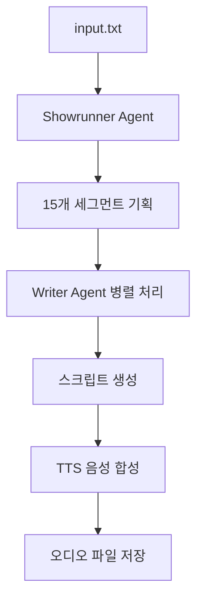

<div align="center">

# 🎙️ LangGraph TTS - 오디오북 변환기

**AI 논문이나 긴 텍스트를 자연스러운 한국어/영어 팟캐스트로 변환하는 CLI 도구**

[](https://github.com/YOUR_USERNAME/langraph_tts)
[](https://www.python.org/)
[](LICENSE)
[](https://langchain-ai.github.io/langgraph/)

*Gemini API를 사용해 텍스트를 분석하고, 다양한 서사 모드로 오디오북을 생성합니다*

[설치](#-설치-방법) • [사용법](#️-사용-방법) • [API 키 설정](#-api-키-설정) • [문제 해결](#-문제-해결)

</div>

---

## ✨ 주요 특징

<div align="center">

| 🎯 기능 | 📝 설명 |
|---------|--------|
| 🤖 **AI Agent 기반** | 논문을 15개 세그먼트로 자동 분해 및 기획 |
| 🎭 **4가지 서사 모드** | 멘토/코치, 이성친구, 친구, 라디오쇼 모드 |
| 🎨 **Rich CLI 인터페이스** | Typer, Rich, Click 기반의 아름다운 터미널 UI |
| 🎨 **Generative Art** | 콘텐츠에 어울리는 커버 아트 자동 생성 (Voronoi) |
| 🌐 **다국어 지원** | 한국어/영어 스크립트 자동 생성 |
| 👤 **개인화** | 청자 이름 개인화 (기본값: "현웅") |
| ⚡ **병렬 처리** | 15개 세그먼트 동시 생성으로 빠른 처리 |
| 🎵 **고품질 음성** | Gemini 2.5 Pro TTS (여성 13개, 남성 16개 음성) |
| 💰 **비용 최적화** | 토큰 소모 60-80% 감소, TTS API 호출 최소화 |
| 📄 **유연한 입력** | `input.txt`에 아무 텍스트나 넣어도 자동 처리 |
| 🔧 **모듈화된 아키텍처** | 서비스 클래스 기반의 깔끔한 코드 구조 |

</div>

---

## 📅 최신 업데이트 (v2.3)

**Rich CLI 및 코드 리팩토링 업데이트입니다!**

### 1️⃣ Rich 기반 CLI 인터페이스 🎨
- **Typer, Rich, Click 통합**: 아름답고 직관적인 터미널 UI
- **대화형 선택 메뉴**: 테이블 형식의 깔끔한 옵션 표시
- **진행 상황 표시**: 실시간 진행 상황 및 상태 업데이트
- **에러 메시지 개선**: 명확하고 읽기 쉬운 에러 표시

### 2️⃣ 코드 리팩토링 및 모듈화 🔧
- **서비스 클래스 도입**: `TTSService`, `AudioService`, `TextService` 등으로 기능 분리
- **코어 모듈 분리**: `RateLimiter`, `ErrorHandler`, `ConfigManager` 등 핵심 기능 모듈화
- **상수 중앙 관리**: 모든 매직 넘버와 문자열 상수를 `constants.py`에서 중앙 관리
- **점진적 마이그레이션**: 기존 코드와의 호환성 유지하며 점진적 개선

### 3️⃣ TTS Rate Limiting 최적화 ⚡
- **9개까지 즉시 전송**: 9개 이하 청크는 1분 안에 연속 전송
- **스마트 대기 로직**: 10번째부터만 rate limit 체크하여 효율성 향상
- **자동 재시도**: Rate limit 오류 시 자동 재시도 및 백오프

### 4️⃣ 오류 처리 개선 🛡️
- **견고한 오류 처리**: 모든 주요 작업에 try-except 적용
- **상세한 로깅**: 오류 발생 시 traceback 출력으로 디버깅 용이
- **안전한 폴백**: 오류 발생 시에도 기본값으로 계속 진행

---

## 📋 필요한 API 키

### 1️⃣ Google Gemini API 키 (필수)

**📌 발급 방법:**

1. [Google AI Studio](https://aistudio.google.com/app/apikey) 접속
2. Google 계정으로 로그인
3. **"Create API Key"** 버튼 클릭
4. API 키가 생성되면 복사 (예: `AIzaSy...` 형식, 약 39자)
5. 안전한 곳에 저장

**🔧 용도**: 
- 텍스트 분석 및 스크립트 생성 (Showrunner, Writer Agent)
- TTS 음성 합성

**⚠️ 보안 주의**: 
- API 키는 절대 공개하지 마세요
- GitHub에 커밋하지 마세요 (`.gitignore`에 포함됨)
- 유출 시 즉시 재발급하세요

### 2️⃣ Google Cloud 서비스 계정 키 (TTS용, 선택사항)

**📌 발급 방법:**

1. [Google Cloud Console](https://console.cloud.google.com/) 접속
2. 프로젝트 생성 또는 선택
3. **API 및 서비스** > **라이브러리** 메뉴로 이동
4. **"Text-to-Speech API"** 검색 후 **활성화** 클릭
5. **IAM 및 관리자** > **서비스 계정** 메뉴로 이동
6. **서비스 계정 만들기** 클릭
7. 서비스 계정 이름 입력 (예: "tts-service") 후 **만들기**
8. **역할** 선택: **"Text-to-Speech API 사용자"** 또는 **"Editor"**
9. **완료** 클릭
10. 생성된 서비스 계정 클릭 > **키** 탭 이동
11. **키 추가** > **JSON 만들기** 클릭
12. 다운로드된 JSON 파일을 안전한 위치에 저장

**🔧 용도**: 음성 합성 (TTS)

**⚠️ 보안 주의**: 
- 서비스 계정 키 파일(JSON)은 절대 GitHub에 커밋하지 마세요
- `.gitignore`에 이미 포함되어 있습니다
- 유출 시 즉시 키를 삭제하고 재생성하세요

---

## 🚀 설치 방법

### 1️⃣ 저장소 클론

```bash
git clone <repository-url>
cd Audiobook-Langgraph-TTS
```

### 2️⃣ 가상환경 생성 및 활성화

<details>
<summary><b>Windows (PowerShell)</b></summary>

```powershell
# 가상환경 생성
py -3 -m venv .venv

# 가상환경 활성화
.\.venv\Scripts\Activate.ps1
```

</details>

<details>
<summary><b>Windows (CMD)</b></summary>

```cmd
# 가상환경 생성
py -3 -m venv .venv

# 가상환경 활성화
.venv\Scripts\activate.bat
```

</details>

<details>
<summary><b>Linux/Mac</b></summary>

```bash
# 가상환경 생성
python3 -m venv .venv

# 가상환경 활성화
source .venv/bin/activate
```

</details>

**✅ 활성화 확인**: 프롬프트 앞에 `(.venv)`가 표시되면 성공입니다.

### 3️⃣ 패키지 설치

```bash
pip install --upgrade pip
pip install -r requirements.txt
```

### 4️⃣ 설치 확인

```bash
python -c "import langgraph; print('✅ LangGraph OK')"
python -c "import google.generativeai; print('✅ Google GenerativeAI OK')"
python -c "import rich; print('✅ Rich OK')"
```

---

## 🖥️ 사용 방법

### 1️⃣ API 키 설정

#### 방법 1: .env 파일 사용 (권장) ⭐

프로젝트 루트 디렉토리에 `.env` 파일을 생성하고 다음 내용을 입력하세요:

```bash
GOOGLE_API_KEY=your-api-key-here
GOOGLE_APPLICATION_CREDENTIALS=C:/path/to/service-account-key.json
```

**⚠️ 중요**: 
- `.env` 파일에는 **주석을 넣지 마세요** (한국어 주석은 인코딩 문제를 일으킬 수 있습니다)
- 값만 입력하세요: `KEY=value` 형식으로만 작성

**📝 파일 생성 방법:**

<details>
<summary><b>Windows (PowerShell)</b></summary>

```powershell
# PowerShell에서
New-Item -Path .env -ItemType File
# 그 다음 텍스트 에디터로 열어서 위 내용 입력
```

</details>

<details>
<summary><b>Linux/Mac</b></summary>

```bash
# .env 파일 생성
cat > .env << EOF
GOOGLE_API_KEY=your-api-key-here
EOF

# 또는 텍스트 에디터로 직접 생성
nano .env
```

</details>

**🔒 보안**: 
- `.env` 파일은 `.gitignore`에 포함되어 있어 GitHub에 올라가지 않습니다
- 실제 API 키를 입력한 `.env` 파일은 절대 공개하지 마세요

#### 방법 2: 환경 변수로 설정

```bash
# Windows (PowerShell)
$env:GOOGLE_API_KEY="your-api-key-here"

# Windows (CMD)
set GOOGLE_API_KEY=your-api-key-here

# Linux/Mac
export GOOGLE_API_KEY="your-api-key-here"
```

#### 방법 3: 대화형 입력

프로그램을 처음 실행하면 API 키를 입력하라는 프롬프트가 나타납니다:

```
🔑 API Key Initialization
======================================================================
✗ No API key found in any configuration
💡 Starting interactive API key setup...

🔐 Google Gemini API Key를 입력하세요: [여기에 API 키 입력]
```

입력한 API 키는 `.env` 파일에 자동 저장됩니다.

**📊 우선순위:**
1. `.env` 파일 (프로젝트 루트) ⭐
2. 시스템 환경 변수
3. config.json (백업용, 하위 호환성)
4. 대화형 입력

### 2️⃣ input.txt 파일 준비

프로젝트 루트 디렉토리에 `input.txt` 파일을 생성하고 변환할 텍스트를 넣습니다:

```
예시:
- AI 논문 (PDF에서 복사한 텍스트)
- 기술 문서
- 뉴스 기사
- 블로그 포스트
- 등등...
```

### 3️⃣ 프로그램 실행

```bash
python main.py
```

**💡 참고**: 가상환경이 활성화되지 않아도 `main.py`가 자동으로 가상환경을 감지하고 사용합니다.

### 4️⃣ 설정 단계

프로그램 실행 후 Rich 기반의 아름다운 인터페이스에서 다음 단계를 진행합니다:

#### 1️⃣ Gemini 모델 선택
- **Gemini 2.5 Flash Lite**: 기본 모델 (빠르고 효율적)
- **Gemini 2.5 Pro**: 고품질 생성 (더 정확하고 상세한 출력)
- **Gemini 2.5 Flash**: 빠른 생성 (빠른 응답, 상대적으로 간결한 출력)

#### 2️⃣ 콘텐츠 카테고리 선택
- 📄 논문/기술 문서 (research_paper)
- 💼 커리어/자기계발 (career)
- 🗣️ 어학 학습 (language_learning)
- 🤔 인문학/에세이 (philosophy)
- 📰 기술 뉴스/트렌드 (tech_news)

#### 3️⃣ 언어 선택
- 한국어 (ko)
- 영어 (en)

#### 4️⃣ 서사 모드 선택

<details>
<summary><b>멘토/코치 모드 (mentor) 🎓</b></summary>

- 따뜻하고 격려적인 톤
- 경험 공유, 실용적 조언
- 학습 콘텐츠에 적합

</details>

<details>
<summary><b>이성친구 모드 (lover) 💕</b></summary>

- 부드럽고 열정적인 톤
- 똑똑한 박사과정 여자친구처럼 대사 생성
- 연구 목적에도 적합

</details>

<details>
<summary><b>친구 모드 (friend) 👥</b></summary>

- 편안하고 장난스러운 톤
- 절친과의 대화 형식

</details>

<details>
<summary><b>라디오쇼 모드 (radio_show) 📻</b></summary>

- 2인 대화 형식
- 첫 번째 화자와 두 번째 화자의 음성을 각각 선택 (성별 제한 없음)

</details>

#### 5️⃣ 음성 선택

**여성 음성 (13개):**
- Achernar (기본값), Aoede, Autonoe, Callirrhoe, Despina, Erinome, Gacrux, Kore, Laomedeia, Leda, Sulafat, Vindemiatrix, Zephyr

**남성 음성 (16개):**
- Achird (기본값), Algenib, Algieba, Alnilam, Charon, Enceladus, Fenrir, Iapetus, Orus, Puck, Pulcherrima, Rasalgethi, Sadachbia, Sadaltager, Schedar, Umbriel, Zubenelgenubi

#### 6️⃣ 청취자 이름 입력
- 기본값: **현웅**
- Enter 키를 누르면 기본값 사용
- 한국어 대본에서는 자동으로 적절한 조사(은/는, 이/가)가 붙습니다

### 5️⃣ 결과 확인

처리가 완료되면 다음 위치에 결과가 저장됩니다:

```
outputs/{오디오제목}_{모드}_{음성}_{언어코드}/
├── {오디오제목}_{모드}_{음성}_{언어코드}.mp3  # 최종 오디오 파일
├── refined_text.txt                          # 생성된 스크립트
├── audio_title.txt                           # 오디오 제목
├── showrunner_segments.json                  # 15개 세그먼트 기획안
└── input.txt                                 # 원본 입력 파일 복사본
```

**📁 추가 저장 위치:**
- `C:/audiiobook/{오디오제목}_{모드}_{음성}_{언어코드}/` (동일한 파일)

---

## 🏗️ 작동 원리

<div align="center">



</div>

### 1단계: Showrunner Agent (기획자) 🎬
- 원본 텍스트를 분석하여 15개 세그먼트로 분해
- 각 세그먼트의 제목, 핵심 내용, 경계 문장 생성
- Reasoning 절차를 거쳐 고품질 세그먼트 생성

### 2단계: Writer Agent (작가) - 병렬 처리 ✍️
- 각 세그먼트를 선택한 언어 및 서사 모드에 맞게 작성
- 원본 텍스트의 관련 섹션만 참고하여 효율적 처리
- 15개 세그먼트를 동시에 병렬 처리

### 3단계: TTS (Text-to-Speech) 🎵
- Gemini 2.5 Pro TTS로 음성 합성
- 선택한 음성으로 자연스러운 오디오 생성
- 9개까지는 1분 안에 연속 전송, 10번째부터 rate limit 적용

### 4단계: 오디오 후처리 🎚️
- 오디오 파일을 최종 위치로 저장
- 메타데이터 및 커버 아트 추가
- `outputs/` 및 `C:/audiiobook/`에 저장

---

## 🔧 문제 해결

<details>
<summary><b>가상환경이 자동으로 활성화되지 않는 경우</b></summary>

프로그램이 자동으로 가상환경을 감지하지만, 수동으로 활성화하려면:

**Windows:**
```powershell
.\.venv\Scripts\Activate.ps1
python main.py
```

**Linux/Mac:**
```bash
source .venv/bin/activate
python main.py
```

</details>

<details>
<summary><b>API 키 오류</b></summary>

- `.env` 파일을 확인하세요
- API 키가 유효한지 확인하세요
- [Google AI Studio](https://aistudio.google.com/app/apikey)에서 키를 재발급하세요

</details>

<details>
<summary><b>패키지 설치 오류</b></summary>

```bash
# pip 업그레이드
python -m pip install --upgrade pip

# 패키지 재설치
pip install -r requirements.txt --force-reinstall
```

</details>

<details>
<summary><b>Showrunner 세그먼트 생성 실패</b></summary>

- 프로그램이 자동으로 최대 3회 재시도합니다
- 실패 시 `temp_output/showrunner_error_*.txt` 파일을 확인하세요
- `input.txt` 파일이 비어있지 않은지 확인하세요

</details>

<details>
<summary><b>TTS Rate Limit 오류</b></summary>

- 프로그램이 자동으로 rate limit을 감지하고 대기합니다
- 9개 이하는 즉시 전송되며, 10번째부터는 자동으로 대기합니다
- 오류 발생 시 자동 재시도됩니다

</details>

---

## 📁 프로젝트 구조

```
Audiobook-Langgraph-TTS/
├── main.py                 # 진입점 (가상환경 자동 감지)
├── src/
│   ├── main.py            # 메인 로직
│   ├── cli.py              # CLI 인터페이스 (하위 호환성)
│   ├── cli/                # Rich 기반 CLI 모듈
│   │   ├── interactive.py  # 대화형 선택 함수들
│   │   └── main.py         # Typer CLI 앱
│   ├── config.py           # 설정 관리 (.env 파일 지원)
│   ├── graph.py            # LangGraph 워크플로우
│   ├── state.py            # AgentState 정의
│   ├── core/               # 핵심 모듈
│   │   ├── constants.py    # 상수 정의
│   │   ├── rate_limiter.py # Rate Limiter 클래스
│   │   ├── error_handler.py # Error Handler 클래스
│   │   └── config_manager.py # Config Manager 클래스
│   ├── models/             # 데이터 모델
│   │   ├── voice.py        # VOICE_BANKS
│   │   ├── narrative.py    # NARRATIVE_MODES
│   │   └── content.py      # CONTENT_CATEGORIES
│   ├── services/           # 서비스 클래스
│   │   ├── tts_service.py  # TTS 서비스
│   │   ├── audio_service.py # 오디오 서비스
│   │   └── text_service.py # 텍스트 서비스
│   ├── utils/              # 유틸리티 모듈
│   │   ├── logging.py      # 로깅 함수
│   │   └── timing.py       # 타이밍 함수
│   ├── utils.py            # 유틸리티 함수 (하위 호환성)
│   ├── nodes/              # Agent 노드들
│   │   ├── showrunner.py   # Showrunner Agent
│   │   ├── writer.py       # Writer Agent
│   │   ├── tts.py          # TTS 생성
│   │   └── audio_postprocess.py  # 오디오 후처리
│   └── server.py           # FastAPI 서버 (선택사항)
├── input.txt               # 입력 텍스트 파일
├── requirements.txt        # Python 패키지 목록
├── .gitignore             # Git 무시 파일
├── LICENSE                # MIT 라이선스
└── README.md              # 이 파일
```

---

## ⚙️ 설정 파일

### .env 파일 (표준 방식, 권장) ⭐

프로젝트 루트 디렉토리에 `.env` 파일을 생성하여 API 키를 관리합니다:

```bash
GOOGLE_API_KEY=your-api-key-here
GOOGLE_APPLICATION_CREDENTIALS=C:/path/to/service-account-key.json
```

**📝 참고:**
- `.env.example` 파일을 참고하여 `.env` 파일을 생성하세요
- `.env.example`은 Git에 포함되지만, 실제 API 키가 들어간 `.env` 파일은 `.gitignore`에 의해 제외됩니다

**📍 위치:**
- 프로젝트 루트 디렉토리: `Audiobook-Langgraph-TTS/.env`

### config.json (백업용, 하위 호환성)

기존 `config.json` 파일도 지원하지만, 새로운 설정은 `.env` 파일 사용을 권장합니다.

**📍 위치:**
- 개발 모드: 프로젝트 루트/`config.json`
- 프로덕션: 사용자 데이터 폴더/`config.json`

---

## 📚 기술 스택

<div align="center">

| 카테고리 | 기술 |
|---------|------|
| **언어** | Python 3.9+ |
| **AI 프레임워크** | LangGraph 1.0+ |
| **LLM** | Google Gemini 2.5 Pro/Flash |
| **TTS** | Google Cloud Text-to-Speech |
| **CLI 프레임워크** | Typer, Rich, Click |
| **환경 관리** | python-dotenv |
| **오디오 처리** | pydub, mutagen |
| **웹 서버** | FastAPI (선택사항) |

</div>

---

## 📄 라이선스

이 프로젝트는 [MIT License](LICENSE) 하에 배포됩니다.

```
MIT License

Copyright (c) 2024-2026 LangGraph TTS Contributors

Permission is hereby granted, free of charge, to any person obtaining a copy
of this software and associated documentation files (the "Software"), to deal
in the Software without restriction, including without limitation the rights
to use, copy, modify, merge, publish, distribute, sublicense, and/or sell
copies of the Software, and to permit persons to whom the Software is
furnished to do so, subject to the following conditions:

The above copyright notice and this permission notice shall be included in all
copies or substantial portions of the Software.

THE SOFTWARE IS PROVIDED "AS IS", WITHOUT WARRANTY OF ANY KIND, EXPRESS OR
IMPLIED, INCLUDING BUT NOT LIMITED TO THE WARRANTIES OF MERCHANTABILITY,
FITNESS FOR A PARTICULAR PURPOSE AND NONINFRINGEMENT. IN NO EVENT SHALL THE
AUTHORS OR COPYRIGHT HOLDERS BE LIABLE FOR ANY CLAIM, DAMAGES OR OTHER
LIABILITY, WHETHER IN AN ACTION OF CONTRACT, TORT OR OTHERWISE, ARISING FROM,
OUT OF OR IN CONNECTION WITH THE SOFTWARE OR THE USE OR OTHER DEALINGS IN THE
SOFTWARE.
```

---

<div align="center">

**Made with ❤️ using LangGraph and Gemini**

**Happy Building! 🎉**

[⬆ Back to Top](#-langgraph-tts---오디오북-변환기)

</div>
